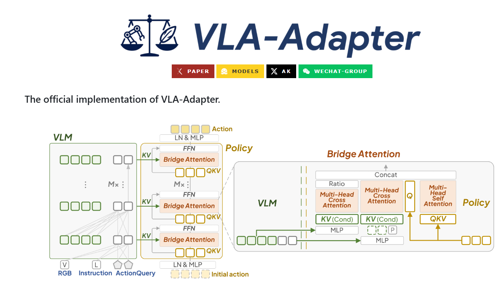
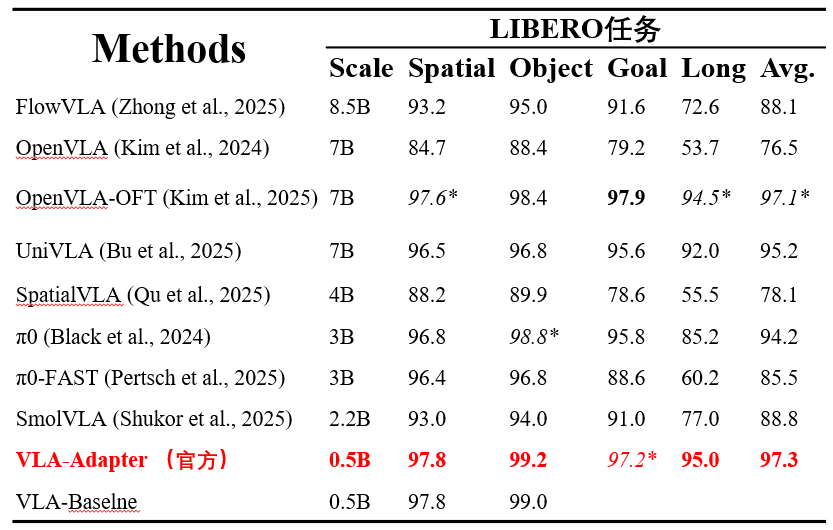

# VLA-Adapter 复现记录（基于 LIBERO）

## 💡说明


VLA-Adapter 实现机器人控制的关键思想是：
在不去改动/重训大尺寸视觉-语言模型主体的前提下，用一个很薄的桥接/适配模块（Adapter + Bridge Attention）把“图像＋指令”得到的通用语义特征，转成专门给动作预测用的机器人表征，这样既能保留大模型的理解能力，又能把训练量收敛在很小的一块参数上。

具体来说：
输入是一段视觉观测（单帧/多帧图像）和一条语言指令，先走进已经训练好的 VLM / LLM 主干（通常是冻结的），得到一串语义+视觉混合的 token 表示。
这些表示并不能直接拿去出机器人动作，因此 VLA-Adapter 在主干后面插入一个轻量的适配层：它做两件事
用 Bridge / Cross-Attention 把“任务相关的动作查询（action query）”去对齐上游的视觉-语言特征；
用门控/残差的方式，只保留对当前任务真的有用的那部分信息，避免把大模型的噪声传到控制端。

和 OpenVLA 把动作离散成 256 个 LLM 词表 token 不同的是，VLA-Adapter 一般不去“占用”大模型词表，而是走一条单独的动作头：把适配后的特征送进一个小的 Transformer/MLP 动作预测头，直接回归/分类出机器人的低维控制量（例如 6/7 维位姿增量 + 夹爪）。


> **📝 Paper: https://arxiv.org/abs/2509.09372**<br/>
> **🌍 Project page: https://vla-adapter.github.io/**<br/>
> **🤗 HuggingFace: https://huggingface.co/VLA-Adapter**<br/>
> **Github: https://github.com/OpenHelix-Team/VLA-Adapter**


## 1. 简介

本仓库用于记录在广工服务器上复现 **VLA-Adapter**（LIBERO 任务）全过程，包含：

- 环境搭建（conda + 离线 pip + mujoco/robosuite）
- 数据集路径配置（本地 `modified_libero_rlds`）
- 训练脚本与关键启动参数
- 推理 / 评估脚本
- 常见报错与修复办法（本次复现真实发生过的）
- 
## 2. 环境搭建

### 2.1安装miniconda
广工的服务器里面没有miniconda，首先要从安装miniconda开始

```bash
cd ~
wget https://mirrors.tuna.tsinghua.edu.cn/anaconda/miniconda/Miniconda3-py310_23.3.1-0-Linux-x86_64.sh
chmod +x Miniconda3-py310_23.3.1-0-Linux-x86_64.sh
bash Miniconda3-py310_23.3.1-0-Linux-x86_64.sh
```

安装完执行：

```bash
source ~/.bashrc
conda --version
```

### 2.2 创建虚拟环境

```bash
conda create -n adapter python=3.10 -y
conda activate adapter
```
### 2.3 安装依赖
```bash
pip install "torch==2.2.0" "torchvision==0.17.0" "torchaudio==2.2.0" \
    -i https://pypi.tuna.tsinghua.edu.cn/simple
```
安装完快速跑自检
```bash
python - <<'PY'
import torch, torchvision, torchaudio
print("torch:", torch.__version__, "cuda:", torch.version.cuda, "available:", torch.cuda.is_available())
print("vision:", torchvision.__version__, "audio:", torchaudio.__version__)
if torch.cuda.is_available():
    print("device:", torch.cuda.get_device_name(0))
PY
```
拉取源码,安装依赖
```bash
git clone https://bgithub.xyz/OpenHelix-Team/VLA-Adapter.git #使用镜像网站
cd VLA-Adapter
pip install -e . #如果无法访问github，进入pyproject.toml把对应github.com改成bgithub.com
pip install packaging ninja
ninja --version; echo $?  # Verify Ninja --> should return exit code "0"
```
安装flash-attn，由于无法访问github，使用离线安装
```bash
cd /home/caohaonian/wheels
wget "https://bgithub.xyz/Dao-AILab/flash-attention/releases/download/v2.5.5/flash_attn-2.5.5+cu122torch2.2cxx11abiFALSE-cp310-cp310-linux_x86_64.whl" 
# 安装
pip install --no-index --find-links . \
  flash_attn-2.5.5+cu122torch2.2cxx11abiFALSE-cp310-cp310-linux_x86_64.whl
```
快速自检,安装成功会显示版本，如果错误说明C++ ABI（cxx11abi）/编译兼容性不匹配，建议问ai选什么版本
```bash
python - <<'PY'
import importlib, torch
print("torch:", torch.__version__, "cuda:", torch.version.cuda)
m = importlib.util.find_spec("flash_attn_2_cuda") or importlib.util.find_spec("flash_attn_cuda")
print("flash_attn CUDA ext found:", bool(m))
import flash_attn
print("flash_attn:", getattr(flash_attn, "__version__", "unknown"))
PY
```
到这一步会有一个版本冲突，没有就跳过
```bash
tensorflow 2.15.0 requires numpy<2.0.0,>=1.23.5, but you have numpy 2.2.6 which is incompatible.
````
解决办法:替换版本，哪个能成功用哪个
```bash
pip uninstall -y numpy scipy
pip install -- "numpy==1.26.4" "scipy==1.11.4" 
````
### 2.4 安装LIBERO
```bash
cd
git clone https://github.com/Lifelong-Robot-Learning/LIBERO.git
pip install -e LIBERO
cd VLA_Adapter
pip install -r experiments/robot/libero/libero_requirements.txt
```
## 3. 开始训练
### 3.1 下载数据集,下载no_noops的libero数据集会比较好
```bash
export HF_ENDPOINT=https://hf-mirror.com
huggingface-cli download --repo-type dataset \
                         --resume-download \
                         --local-dir modified_libero_rlds \
                         openvla/modified_libero_rlds
```
### 3.2微调libero_object任务
```bash
mkdir -p /home/caohaonian/VLA-Adapter/logs
export NCCL_P2P_DISABLE=1
export NCCL_IB_DISABLE=1
export WANDB_MODE=offline
export TRANSFORMERS_OFFLINE=1
export HF_HUB_OFFLINE=1
CUDA_VISIBLE_DEVICES=0,1 MASTER_ADDR=127.0.0.1 MASTER_PORT=29501 \
WANDB_MODE=offline NCCL_P2P_DISABLE=1 NCCL_IB_DISABLE=1 \
torchrun --standalone --nproc-per-node 1 /home/caohaonian/VLA-Adapter/vla-scripts/finetune.py
--vlm_path /home/caohaonian/VLA-Adapter/pretrained_models/prism-qwen25-extra-dinosiglip-224px-0_5b
--config_file_path /home/caohaonian/VLA-Adapter/pretrained_models/configs
--data_root_dir /home/caohaonian/datasets/modified_libero_rlds
--dataset_name libero_object_no_noops
--run_root_dir /home/caohaonian/VLA-Adapter/outputs
--use_pro_version True
--use_lora True
--lora_rank 64
--use_film False
--use_minivlm True
--num_images_in_input 2
--use_proprio True
--image_aug True
--batch_size 1
--grad_accumulation_steps 8 --learning_rate 2e-4
--num_steps_before_decay 9000 --max_steps 10000
--save_freq 1000 --save_latest_checkpoint_only False
--merge_lora_during_training True
--wandb_entity ""
--wandb_project ""   2>&1 | tee -a "$LOG"

```
### 3.3微调libero_long任务
微调long任务不能把显存用太多，需要留一点给merge_lora_during_training True
```bash
CUDA_VISIBLE_DEVICES=0,1,2,3 MASTER_ADDR=127.0.0.1 MASTER_PORT=29501 \
WANDB_MODE=offline NCCL_P2P_DISABLE=1 NCCL_IB_DISABLE=1 \
torchrun --standalone --nproc-per-node 4 /home/caohaonian/VLA-Adapter/vla-scripts/finetune.py \
  --vlm_path /home/caohaonian/VLA-Adapter/pretrained_models/prism-qwen25-extra-dinosiglip-224px-0_5b \
  --config_file_path /home/caohaonian/VLA-Adapter/pretrained_models/configs \
  --data_root_dir /home/caohaonian/datasets/modified_libero_rlds \
  --dataset_name libero_10_no_noops \
  --run_root_dir /home/caohaonian/VLA-Adapter/outputs \
  --use_pro_version True --use_lora True --lora_rank 64 \
  --use_film False --use_minivlm True --num_images_in_input 2 \
  --use_proprio True --image_aug True \
  --batch_size 4 \
  --grad_accumulation_steps 8 \
  --learning_rate 2e-4 \
  --num_steps_before_decay 45000 \
  --max_steps 50000 \
  --save_freq 5000 \
  --save_latest_checkpoint_only False \
  --merge_lora_during_training True \
  --wandb_entity "" --wandb_project "" \
  2>&1 | tee -a /home/caohaonian/VLA-Adapter/logs/libero_long_bs4x8_$(date +%Y%m%d_%H%M%S).log
```
### 3.4其他libero任务

## 4.实验结果
部分结果如图：

